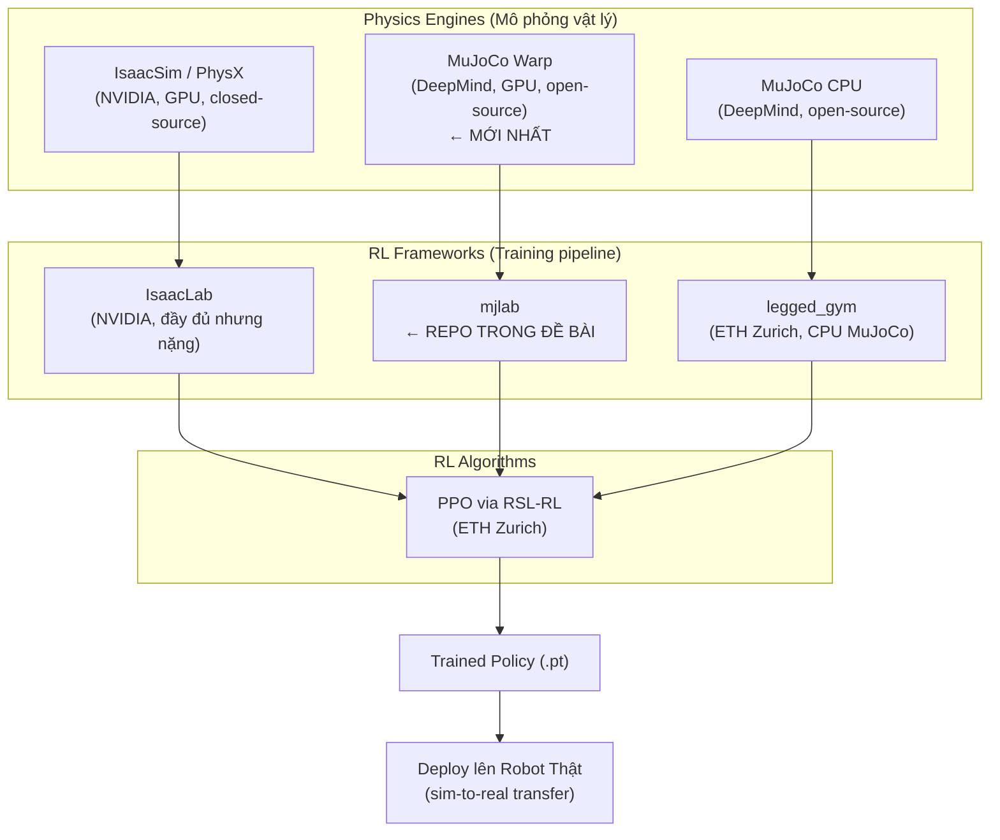
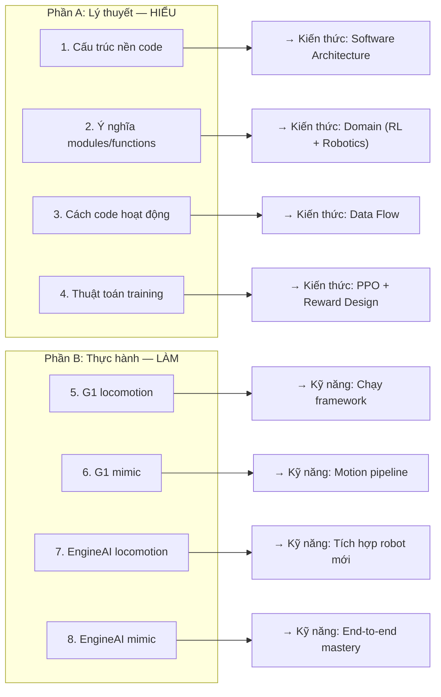

# Tổng Quan Toàn Cảnh: Từ Bài Toán Robot → mjlab → Bài Test

---

## Chương 1: Bức Tranh Toàn Cảnh — Tại Sao Cần Tất Cả Những Thứ Này?

### 1.1 Bài toán gốc: Làm sao để robot humanoid đi được?

Robot humanoid (2 chân) là một trong những hệ thống cơ khí phức tạp nhất mà con người chế tạo. Khác với robot bánh xe (ổn định tĩnh) hay cánh tay công nghiệp (cố định base), humanoid phải đối mặt với:

**Thách thức cốt lõi — Unstable Dynamics:**
- Robot 2 chân **luôn trong trạng thái gần ngã**. Khi bạn đi bộ, mỗi bước chân thực chất là một "cú ngã có kiểm soát" — trọng tâm liên tục dịch chuyển ra ngoài vùng support polygon (diện tích chân chạm đất)
- Humanoid phải **chủ động cân bằng mỗi khoảnh khắc** — không giống xe có 4 bánh tự ổn định

**Không gian hành động khổng lồ:**
- EngineAI PM_v2: **24 bậc tự do** (DOFs) — 24 motor cần điều khiển đồng thời
- Mỗi motor nhận tín hiệu điều khiển ở **50Hz** (50 lần/giây — tần số điều khiển)
- → Mỗi giây: `24 motors × 50 Hz = 1200 quyết định` phải đưa ra, MỌI quyết định đều ảnh hưởng lẫn nhau

**Tương tác vật lý phi tuyến:**
- Lực ma sát chân-đất phụ thuộc hướng di chuyển + lực pháp tuyến (Coulomb friction)
- Quán tính từng chi ảnh hưởng khi vung tay/xoay người
- Va chạm giữa các bộ phận cơ thể robot (self-collision)
- Trọng lực tác dụng liên tục — nghiêng 1° có thể thành ngã sau 0.5s

**Các cách tiếp cận truyền thống:**

| Phương pháp | Mô tả | Hạn chế |
|-------------|-------|---------|
| **ZMP** (Zero Moment Point) | Giữ projection của trọng tâm trong support polygon | Chỉ cho gait chậm, cứng nhắc |
| **MPC** (Model Predictive Control) | Tối ưu quỹ đạo trong horizon ngắn | Cần model chính xác, tính toán nặng |
| **CPG** (Central Pattern Generator) | Tạo pattern tuần hoàn cho gait | Khó adapt, giới hạn với locomotion |

→ Tất cả đều **giòn** (fragile): nhạy với mismatch model, khó generalize sang tình huống mới.

### 1.2 Giải pháp: Reinforcement Learning

Thay vì engineer bộ điều khiển thủ công, **hãy để robot tự học** qua thử-và-sai:

```
Robot ở trạng thái s → chọn hành động a → nhận reward r → chuyển sang s'
                          ↑                      ↓
                          └──── cập nhật policy ──┘
                               (tối đa hóa tổng reward)
```

**RL cho humanoid = Supervised Learning cho locomotion:**
- Không có "đáp án đúng" (không ai biết torque tối ưu cho mỗi khớp mỗi ms)
- Thay vào đó, thiết kế **reward function** (hàm thưởng/phạt):
  - Thưởng: đi đúng tốc độ yêu cầu, giữ thân ổn định
  - Phạt: ngã, tiêu tốn năng lượng, động tác giật
- Robot tự tìm ra cách tối ưu qua hàng triệu lần thử

**Tại sao RL thay vì điều khiển cổ điển?**
- **Không cần model chính xác**: RL tự học dynamics từ interaction
- **Robust**: domain randomization (thay đổi ma sát, khối lượng, delay) trong training → policy robust khi deploy
- **Versatile**: cùng framework, chỉ đổi reward → đi/chạy/nhảy/bắt chước
- **Sim-to-real transfer**: train trong sim → chạy trên robot thật (đã được chứng minh bởi nhiều lab)

### 1.3 Tại sao cần simulation (không train trên robot thật)?

Training RL cần **hàng tỷ timesteps** (30K iterations × 24 steps × 512 envs = ~370 triệu steps). Trên robot thật:

| Yếu tố | Robot thật | Simulation GPU |
|---------|-----------|----------------|
| Tốc độ | 1x realtime | **100-1000x** realtime |
| Song song | 1 robot | **512-8192** robot cùng lúc |
| An toàn | Robot hỏng khi ngã | Reset tức thì, miễn phí |
| Thời gian 370M steps | ~**4 tháng** (24/7) | **4-12 giờ** |
| Reset sau ngã | Phải đặt lại bằng tay | Tự động, 0ms |

→ **GPU-accelerated simulation** là yêu cầu bắt buộc.

### 1.4 Hệ sinh thái sim-to-real cho humanoid — mjlab ở đâu?



**So sánh 3 frameworks:**

| | IsaacLab (NVIDIA) | legged_gym (ETH) | mjlab |
|---|---|---|---|
| Physics | PhysX (GPU) | MuJoCo (CPU) | MuJoCo Warp (GPU) |
| Install | ~20GB IsaacSim | pip install | `uv run demo` (1 lệnh) |
| Speed | Nhanh nhất | Chậm (CPU) | Nhanh (GPU) |
| API | Manager-based | Monolithic | Manager-based (fork Isaac) |
| Ecosystem | NVIDIA lock-in | Độc lập | Độc lập + MuJoCo native |
| Maturity | Production | Battle-tested | Mới (2026) |

**Tại sao giám khảo chọn mjlab?**
1. **Mới nhất** — MuJoCo Warp vừa ra → đánh giá khả năng làm việc với tech mới
2. **Nhẹ, dễ extend** — cấu trúc sạch → dễ đánh giá kỹ năng đọc code
3. **Manager-based** — pattern phổ biến trong industry → có thể đánh giá design thinking
4. **Open-source** — truy cập toàn bộ source code → đánh giá hiểu sâu

---

## Chương 2: Đề Bài Muốn Gì? — Phân Tích Từng Yêu Cầu

Đề gốc:
> *"Giải thích cấu trúc nền code, ý nghĩa các module và function, cách nền code hoạt động, và thuật toán training đang được triển khai. Train locomotion policy và mimic policy với Unitree G1 và EngineAI."*

### 2.1 Tách đề bài thành 8 yêu cầu cụ thể



### 2.2 Giám khảo đánh giá gì ở mỗi yêu cầu?

#### Yêu cầu 1: "Giải thích cấu trúc nền code"

**Đây KHÔNG phải liệt kê folder.** Giám khảo muốn thấy bạn hiểu **3 cấp độ**:

| Cấp độ | Câu hỏi cần trả lời | Ví dụ câu trả lời tốt |
|--------|---------------------|----------------------|
| **Why** (Tại sao?) | Tại sao code tổ chức như vậy? Design philosophy? | *"Manager-based pattern tách biệt concerns: thay đổi reward không ảnh hưởng observation, thêm robot mới không đụng logic training. Điều này cho phép nhà nghiên cứu iterate nhanh trên từng component."* |
| **How** (Như thế nào?) | Các module tương tác ra sao? | *"Khi env.step() được gọi: ActionManager map action→torque, sim advance physics, ObservationManager đọc state mới, RewardManager tính reward — tất cả diễn ra batched trên GPU."* |
| **What** (Cái gì?) | Mỗi module chứa gì cụ thể? | *"actuator/ implement PD controller: τ = kp×(q_target - q_actual) - kd×q̇. Trong mjlab, đây là IdealPDActuator class nhận action là target joint position."* |

**Câu trả lời dở**: *"src/mjlab có 12 thư mục: actuator, asset_zoo, entity, ..."* — chỉ mô tả, không hiểu.

#### Yêu cầu 2: "Ý nghĩa các module và function"

Giám khảo muốn bạn giải thích **tại sao module đó tồn tại**, không chỉ nó làm gì:

| Module | Mô tả bề mặt (❌) | Giải thích sâu (✅) |
|--------|---|---|
| `managers/` | Quản lý obs, reward, action | **Là trái tim kiến trúc**. Isaac Lab đúc kết kinh nghiệm: RL env luôn có 6 thành phần lặp lại (obs, action, reward, termination, event, curriculum). Thay vì viết lại mỗi task, trừu tượng hóa thành managers với config — giảm 80% code lặp |
| `sim/` | Interface MuJoCo Warp | **Bọc GPU simulation**. MuJoCo Warp chạy batched: 1 mjx_data chứa state của N robots. sim/ cung cấp API sạch để step, reset single envs trong batch mà không rebuild toàn bộ |
| `entity/` | Robot abstraction | **Bridge giữa MJCF và RL**. Robot MJCF định nghĩa 100+ bodies/joints, nhưng RL chỉ cần subset (controlled joints, observation bodies). Entity extract đúng data cần thiết từ mjx_data lớn |
| `asset_zoo/` | Chứa robot models | **Centralize robot knowledge**. Mỗi robot cần: MJCF files, joint ordering, default pose, PD gains, foot body names. Gom vào 1 chỗ → dễ thêm robot mới |

#### Yêu cầu 3: "Cách nền code hoạt động"

Giám khảo muốn bạn trace **data flow từ đầu đến cuối**:

```
User chạy: uv run train Mjlab-Velocity-Flat-Unitree-G1

scripts/train.py
  → TaskRegistry lookup "Mjlab-Velocity-Flat-Unitree-G1"
  → Trả về (env_cfg, rl_cfg, runner_cls)
  → Tạo ManagerBasedRlEnv(env_cfg)
      → Scene: load MJCF → tạo mjx.Data cho N envs trên GPU
      → Init managers: ObsManager, ActionManager, RewardManager, ...
  → Tạo RslRlVecEnvWrapper(env)
      → Adapt interface cho RSL-RL
  → Tạo MjlabOnPolicyRunner(wrapper, rl_cfg)
      → Init ActorCritic networks
      → Init PPO algorithm

  → runner.train():
      For iter = 1 to 30000:
        # ROLLOUT
        For step = 1 to 24:
          obs = wrapper.get_observations()           # GPU tensor
          action = actor(obs)                        # Neural network forward pass
          obs', reward, done, info = wrapper.step(action)
          storage.add(obs, action, reward, value, done)
        EndFor

        # PPO UPDATE
        advantages = compute_gae(storage)            # GPU
        For epoch = 1 to 5:
          For mini_batch in shuffle_split(storage, 4):
            loss = ppo_loss(mini_batch, advantages)
            optimizer.step(loss)
          EndFor
        EndFor
        adapt_learning_rate(kl_divergence)

        # LOGGING
        log_to_wandb(reward_mean, episode_length, lr)
        If iter % 50 == 0: save checkpoint
      EndFor
```

**Bên trong env.step(action) — CỐT LÕI**:

```
env.step(action):
  1. ActionManager.process(action)
     → Clamp action to limits
     → Scale: action = default_pos + action * action_scale
     → Đây là TARGET joint position (không phải torque)

  2. For substep in range(decimation):  # thường decimation=4
       actuator.compute_torque(target_pos, current_pos, current_vel)
         → τ = kp * (target - q) - kd * q̇    # PD controller
       mjx_data = mujoco_warp.step(mjx_data, τ)  # GPU physics
     EndFor
      # Mỗi train step = 4 physics steps
      # Physics dt = 0.005s, control dt = 0.02s → 50Hz control

  3. ObservationManager.compute()
     → Read joint_pos, joint_vel from mjx_data
     → Compute base_ang_vel, projected_gravity from IMU
     → Concatenate: [joint_pos, joint_vel, ang_vel, gravity, cmd, prev_action]
     → Normalize if obs_normalization=True

  4. RewardManager.compute()
     → For each reward term:
         velocity_tracking:  exp(-||v_actual - v_cmd||² / σ²) × weight
         angular_vel_tracking: exp(-||ω_actual - ω_cmd||² / σ²) × weight
         energy_penalty:     -||torque × joint_vel|| × weight
         action_smoothness:  -||action - prev_action||² × weight
         orientation:        -||projected_gravity - [0,0,-1]||² × weight
         ...
     → total_reward = Σ weighted_terms

  5. TerminationManager.check()
     → base_height < threshold? → terminated
     → base_tilt > max_tilt? → terminated
     → episode_length > max_length? → truncated

  6. EventManager.apply() (nếu reset)
     → Randomize: friction, mass, PD gains, initial pose
     → Domain randomization → robust sim-to-real transfer
```

#### Yêu cầu 4: "Thuật toán training"

Không chỉ mô tả PPO chung chung. Cần giải thích **PPO trong ngữ cảnh mjlab cụ thể**:

**PPO — Proximal Policy Optimization:**

Ý tưởng cốt lõi: cập nhật policy **từ từ**, không thay đổi quá nhiều mỗi lần → ổn định.

```
L_PPO = -E[ min(r(θ) × A, clip(r(θ), 1-ε, 1+ε) × A) ]

Trong đó:
  r(θ) = π_new(a|s) / π_old(a|s)    — tỉ lệ xác suất mới/cũ
  A = advantage                       — hành động này tốt hơn kỳ vọng bao nhiêu
  ε = 0.2                             — clip range (giới hạn thay đổi)
  clip(r, 0.8, 1.2)                   — ép r trong [0.8, 1.2]
```

**Tại sao PPO mà không phải algorithm khác?**
- **SAC** (off-policy): tốt cho manipulation nhưng kém cho locomotion (cần on-policy stability)
- **TD3** (off-policy): tương tự SAC
- **PPO** (on-policy): ổn định, dễ tune, proven cho locomotion (ETH Zurich, UC Berkeley, Google)
- RSL-RL chọn PPO vì community đã validate rộng rãi cho legged robots

**Hyperparameters cụ thể trong mjlab:**

| Parameter | Giá trị | Tại sao giá trị này |
|-----------|---------|---------------------|
| Actor: [512, 256, 128] | 3 layers MLP | Đủ capacity cho locomotion, không quá lớn → overfit |
| ELU activation | smooth, gradient ≠ 0 | Tốt hơn ReLU cho continuous control |
| obs_normalization=True | Running mean/std | Chuẩn hóa obs range → training ổn định |
| lr=1e-3, adaptive | Giảm khi KL↑ | Tự điều chỉnh: KL > 0.01 → lr giảm → safe update |
| γ=0.99 | Discount factor | Nhìn xa ~100 steps → ~2s horizon (ở 50Hz control) |
| λ=0.95 | GAE lambda | Cân bằng bias-variance trong advantage estimation |
| clip=0.2 | PPO clip range | Tiêu chuẩn industry, quá nhỏ → learn chậm, quá lớn → unstable |
| 5 epochs, 4 mini-batches | Reuse data 5 lần | On-policy nên không nên reuse quá nhiều → 5 là balance |
| 24 steps/env | Rollout length | ~0.5s experience/rollout → đủ thấy hệ quả ngã hay không |

**Adaptive Learning Rate (đặc biệt):**
```python
# Sau mỗi PPO update, tính KL divergence
kl = compute_kl(π_old, π_new)

if kl > 2 * desired_kl:   # policy thay đổi quá nhiều
    lr *= 0.5              # giảm lr → safe
elif kl < desired_kl / 2:  # policy thay đổi quá ít
    lr *= 2.0              # tăng lr → learn nhanh hơn
```
→ Tự điều chỉnh tốc độ học: nhanh khi safe, chậm khi risky.

### 2.3 Phần B — Giám khảo đánh giá gì ở thực hành?

#### Yêu cầu 5-6: Train G1 (mức "baseline")

| Đánh giá | Họ kiểm tra | Bạn cần chứng minh |
|----------|------------|-------------------|
| Biết setup | Cài được mjlab + chạy demo | Log/screenshot quá trình setup |
| Biết train | Training chạy không lỗi | Training curves + WandB link |
| Biết evaluate | Play policy + nhận xét | Video + phân tích kết quả |
| Hiểu motion pipeline | csv_to_npz + WandB registry | Giải thích flow PKL→CSV→NPZ |

#### Yêu cầu 7-8: Train EngineAI (mức "differentiation" — PHẦN QUYẾT ĐỊNH)

> [!IMPORTANT]
> Đây là phần phân biệt **người hiểu** vs **người copy-paste**. G1 đã có sẵn config → ai cũng chạy được. EngineAI buộc bạn phải _hiểu_ framework đủ sâu để _extend_ nó.

| Đánh giá | Họ kiểm tra | Bạn cần chứng minh |
|----------|------------|-------------------|
| Đọc MJCF | Hiểu robot model XML | Liệt kê đúng joints, body names, actuators |
| Tạo config đúng pattern | Follow asset_zoo convention | Code sạch, giống style G1 |
| Adapt reward/obs | Biết gì cần thay đổi | Giải thích tại sao thay đổi base_height threshold, PD gains |
| Debug | Khi robot ngã → sửa ở đâu | Log quá trình debug: "thử giảm kd → robot ổn hơn" |
| Motion pipeline | PKL → CSV → NPZ → train | Script convert + kết quả train |
| So sánh | G1 vs EngineAI insights | "EngineAI train nhanh hơn vì ít DOFs..." |

---

## Chương 3: Pipeline Cụ Thể — Từ Robot Model Đến Trained Policy

### 3.1 Giai đoạn CHUẨN BỊ — 3 thứ cần setup

#### A. Robot Model (asset_zoo)

```
asset_zoo/robots/unitree_g1/          ← MẪU ĐÃ CÓ
├── __init__.py                        # Export UNITREE_G1_CFG
├── g1_constants.py                    # Tất cả constants robot-specific
│   ├── JOINT_NAMES: list[str]         # ["left_hip_pitch", ...]
│   ├── DEFAULT_JOINT_POS: dict        # {"left_hip_pitch": -0.12, ...}
│   ├── PD_GAINS: dict                 # {"kp": {...}, "kd": {...}}
│   ├── FEET_BODIES: list[str]         # ["left_foot", "right_foot"]
│   └── TORSO_BODY: str               # "torso"
└── xmls/                             # MuJoCo model files
    ├── g1.xml                         # Main MJCF (include others)
    ├── assets.xml                     # Mesh references
    └── ...

asset_zoo/robots/engineai_pmv2/       ← CẦN TẠO MỚI (copy pattern)
├── __init__.py
├── pmv2_constants.py
│   ├── JOINT_NAMES: 24 joints         # ["J00_HIP_PITCH_L", ...]
│   ├── DEFAULT_JOINT_POS              # Từ MJCF keyframe
│   ├── PD_GAINS                       # Cần tune cho PM_v2
│   ├── FEET_BODIES                    # ["LINK_ANKLE_ROLL_L", "LINK_ANKLE_ROLL_R"]
│   └── TORSO_BODY                     # "LINK_BASE"
└── xmls/
    ├── serial_pm_v2.xml               # Copy từ EngineAI repo
    ├── serial_links.xml
    ├── serial_actuators.xml
    ├── serial_sensors.xml
    ├── assets.xml
    └── meshes/                        # Copy mesh files
```

#### B. Task Config (velocity / tracking)

Mỗi task cần 3 files:

```
tasks/velocity/config/g1/              ← MẪU ĐÃ CÓ
├── __init__.py                         # register_mjlab_task(...)
├── env_cfgs.py                         # ManagerBasedRlEnvCfg
│   ├── scene:
│   │   ├── robot: model path, num_envs
│   │   └── terrain: flat/rough
│   ├── observations:
│   │   ├── policy: [joint_pos, joint_vel, base_ang_vel,
│   │   │            projected_gravity, velocity_command,
│   │   │            previous_action]
│   │   └── critic: (same or more)
│   ├── actions:
│   │   └── joint_pos: scale, offset (= default_pos)
│   ├── rewards:
│   │   ├── velocity_tracking_xy: weight=1.0, exp kernel
│   │   ├── angular_vel_tracking_z: weight=0.5
│   │   ├── energy: weight=-0.001
│   │   ├── action_smoothness: weight=-0.01
│   │   ├── orientation: weight=-1.0
│   │   ├── base_height: weight=-1.0, target=0.82
│   │   └── ...
│   ├── terminations:
│   │   ├── base_height < 0.3 → terminated
│   │   ├── base_tilt > 60° → terminated
│   │   └── episode_length > 1000 → truncated
│   └── events:
│       ├── randomize_friction: [0.5, 1.5]
│       ├── randomize_mass: [-1kg, +1kg]
│       └── push_robot: force=[0, 100]N
└── rl_cfg.py                           # RslRlOnPolicyRunnerCfg
    ├── actor: [512, 256, 128], elu
    ├── critic: [512, 256, 128], elu
    ├── algorithm: PPO hyperparams
    └── experiment_name, max_iterations
```

**Khi tạo config cho EngineAI, cần thay đổi gì?**

| Field | G1 | EngineAI PM_v2 | Tại sao khác |
|-------|----|----|---|
| Joint names | 29 joints | 24 joints | Ít arm joints, 1 waist, 1 head |
| Default pos | G1 defaults | `[0,0,-0.12,0.24,-0.12,0,...]` | Từ MJCF keyframe |
| Base height target | ~0.75m? | ~0.79m | PM_v2 thấp hơn |
| Termination height | 0.3m? | Cần tune | Tỉ lệ với chiều cao robot |
| PD gains | G1 specific | Cần tune | Motor khác → gain khác |
| Foot bodies | G1 foot names | `LINK_ANKLE_ROLL_L/R` | Tên trong MJCF khác |
| Action space dim | 29 | 24 | Ít DOFs hơn |

#### C. Motion Data (chỉ cho mimic policy)

```
Pipeline cho G1:
  LAFAN1 CSV (HuggingFace) → mjlab csv_to_npz → NPZ → WandB → train
  (đã retarget cho G1, format: [x,y,z,qx,qy,qz,qw,j1,...,j29] per frame)

Pipeline cho EngineAI:
  PKL (giám khảo cung cấp) → pkl_to_csv.py → CSV → mjlab csv_to_npz → NPZ → WandB → train
  
  PKL structure:
    {'fps': 30.0,
     'root_pos': (N, 3),    # base position
     'root_rot': (N, 4),    # quaternion
     'dof_pos':  (N, 24)}   # joint angles

  CSV cần tạo:
    Mỗi dòng = 1 frame: [x, y, z, qx, qy, qz, qw, j0, j1, ..., j23]
    Tổng: 7 + 24 = 31 giá trị mỗi dòng
```

### 3.2 Giai đoạn TRAINING — Chi tiết vòng lặp

```
uv run train Mjlab-Velocity-Flat-Unitree-G1 --env.scene.num-envs 512

Iteration     Reward     Episode_Len   LR          Status
────────────────────────────────────────────────────────────
1/30000       -2.45      23            1.0e-3      Đang ngã liên tục
100/30000     +0.12      89            8.0e-4      Bắt đầu balancing
500/30000     +3.45      456           6.0e-4      Đi được vài bước
2000/30000    +8.92      1000          4.0e-4      Đi ổn định
10000/30000   +12.3      1000          2.0e-4      Tracking tốt
30000/30000   +14.1      1000          1.0e-4      Converged
```

**Cách đọc training curves:**
- **Reward tăng monotonic** → training đang hoạt động ✅
- **Episode length đạt max (1000)** → robot không ngã cả episode ✅
- **LR giảm dần** → adaptive schedule đang hoạt động ✅
- **Reward plateau** → đã converge, có thể dừng ✅

**Dấu hiệu có vấn đề:**
- Reward = 0 mãi → robot ngã ngay frame 1 → sai default pose hoặc PD gains
- Reward tăng rồi diverge → lr quá cao → giảm lr hoặc clip
- Episode length ngắn nhưng reward cao → reward design sai (cheating)
- NaN xuất hiện → simulation unstable → giảm timestep hoặc check model

### 3.3 Giai đoạn ĐÁNH GIÁ — Thế nào là "thành công"?

```bash
# Evaluate locomotion
uv run play Mjlab-Velocity-Flat-Unitree-G1 \
  --checkpoint-file model_30000.pt --viewer native

# Robot sẽ nhận random velocity commands:
#   v_x ∈ [-1, 1] m/s      (tiến/lùi)
#   v_y ∈ [-0.5, 0.5] m/s  (trái/phải)
#   ω_z ∈ [-1, 1] rad/s    (xoay)
```

| Kết quả | Locomotion (tốt) | Locomotion (xấu) |
|---------|-----------------|-----------------|
| Đi | Đi mượt, đúng tốc độ lệnh | Đứng yên hoặc trượt |
| Xoay | Xoay đúng hướng | Xoay sai hướng hoặc quá quá |
| Ổn định | Không ngã trong 30s+ | Ngã sau vài bước |
| Tự nhiên | Gait giống người | Rung, giật, shuffle |

| Kết quả | Mimic (tốt) | Mimic (xấu) |
|---------|------------|------------|
| Boxing | Tay đấm đúng motion | Đứng yên hoặc random |
| Dance | Bắt chước nhảy | Chỉ balancing |
| Kicking | Đá đúng timing | Ngã khi đá |

---

## Chương 4: Hai Robot — So Sánh Chi Tiết G1 vs EngineAI PM_v2

### 4.1 Thông số kỹ thuật

| Thông số | Unitree G1 | EngineAI PM_v2 |
|----------|-----------|----------------|
| Tổng DOFs | 29 | 24 |
| Chiều cao base | ~1.2m | 0.82m |
| Chân (mỗi bên) | 6 DOF: hip×3 + knee + ankle×2 | 6 DOF: hip×3 + knee + ankle×2 |
| Lưng/eo | 3 DOF: yaw + roll + pitch | 1 DOF: yaw only |
| Tay (mỗi bên) | 7 DOF: shoulder×3 + elbow + wrist×3 | 5 DOF: shoulder×3 + elbow_pitch + elbow_yaw |
| Đầu | 0 DOF | 1 DOF: yaw |
| Có wrist? | ✅ Có (3 DOF) | ❌ Không |
| Trong mjlab | ✅ Sẵn | ❌ Tự tích hợp |

### 4.2 Joint Layout EngineAI PM_v2 (24 DOFs)

```
ID  | Joint Name          | Nhóm      | Ctrl Range (Nm)
----|---------------------|-----------|----------------
J00 | HIP_PITCH_L         | Left Leg  | ±164
J01 | HIP_ROLL_L          | Left Leg  | ±164
J02 | HIP_YAW_L           | Left Leg  | ±61
J03 | KNEE_PITCH_L        | Left Leg  | ±164
J04 | ANKLE_PITCH_L       | Left Leg  | ±61
J05 | ANKLE_ROLL_L        | Left Leg  | ±61
J06 | HIP_PITCH_R         | Right Leg | ±164
J07 | HIP_ROLL_R          | Right Leg | ±164
J08 | HIP_YAW_R           | Right Leg | ±61
J09 | KNEE_PITCH_R        | Right Leg | ±164
J10 | ANKLE_PITCH_R       | Right Leg | ±61
J11 | ANKLE_ROLL_R        | Right Leg | ±61
J12 | WAIST_YAW           | Waist     | ±61
J13 | SHOULDER_PITCH_L    | Left Arm  | ±61
J14 | SHOULDER_ROLL_L     | Left Arm  | ±61
J15 | SHOULDER_YAW_L      | Left Arm  | ±61
J16 | ELBOW_PITCH_L       | Left Arm  | ±61
J17 | ELBOW_YAW_L         | Left Arm  | ±61
J18 | SHOULDER_PITCH_R    | Right Arm | ±61
J19 | SHOULDER_ROLL_R     | Right Arm | ±61
J20 | SHOULDER_YAW_R      | Right Arm | ±61
J21 | ELBOW_PITCH_R       | Right Arm | ±61
J22 | ELBOW_YAW_R         | Right Arm | ±61
J23 | HEAD_YAW            | Head      | ±61

Default pose (from keyframe):
qpos = [0 0 0.82  1 0 0 0                          # freejoint: pos + quat
        0 0 -0.12 0.24 -0.12 0                      # left leg
        0 0 -0.12 0.24 -0.12 0                      # right leg
        0                                            # waist
        0 0 0 0 0                                    # left arm
        0 0 0 0 0                                    # right arm
        0]                                           # head
```

### 4.3 Motion Data có sẵn cho EngineAI

```
EngineAI_DATA/
├── boxing_30FPS.pkl     97 frames,  3.2s  → đấm boxing
├── boxing.mp4                               → video demo
├── dance_30FPS.pkl      252 frames, 8.4s  → nhảy
├── dance.mp4                                → video demo
├── kicking_30FPS.pkl    152 frames, 4.6s  → đá
└── kicking.mp4                              → video demo
```

### 4.4 Khác biệt ảnh hưởng training thế nào?

| Khác biệt | Ảnh hưởng đến training |
|-----------|----------------------|
| Ít DOFs (24 vs 29) | Observation/action space nhỏ hơn → có thể converge nhanh hơn |
| Thấp hơn (0.82 vs 1.2m) | Trọng tâm thấp → **có thể** ổn định hơn |
| Waist 1DOF | Ít flexibility xoay thân → locomotion có thể kém mượt |
| Không có wrist | Mimic bị giới hạn: motion reference phải bỏ qua wrist rotation |
| Leg motors mạnh hơn (±164Nm) | Có thể cần PD gains khác → kp, kd cần tune |

---

## Chương 5: Deliverables & Thang Đánh Giá

### Deliverables cuối cùng

| # | Deliverable | Format | Chứng minh điều gì |
|---|-------------|--------|-------------------|
| 1 | Big picture overview | Markdown | Hiểu tổng quan |
| 2 | Tài liệu kiến trúc mjlab | Markdown + diagrams | Hiểu design patterns + data flow |
| 3 | Tài liệu PPO + reward analysis | Markdown | Hiểu thuật toán + domain knowledge |
| 4 | G1 locomotion: curves + video | WandB + MP4 | Biết dùng framework |
| 5 | G1 mimic: curves + video | WandB + MP4 | Hiểu motion pipeline |
| 6 | EngineAI source code | Python (asset + task configs) | **Hiểu framework đủ sâu để extend** |
| 7 | EngineAI locomotion: curves + video | WandB + MP4 | Engineering thực tế |
| 8 | EngineAI mimic: curves + video | WandB + MP4 | **End-to-end mastery** |
| 9 | So sánh G1 vs EngineAI | Markdown | Phân tích kỹ thuật chuyên sâu |
