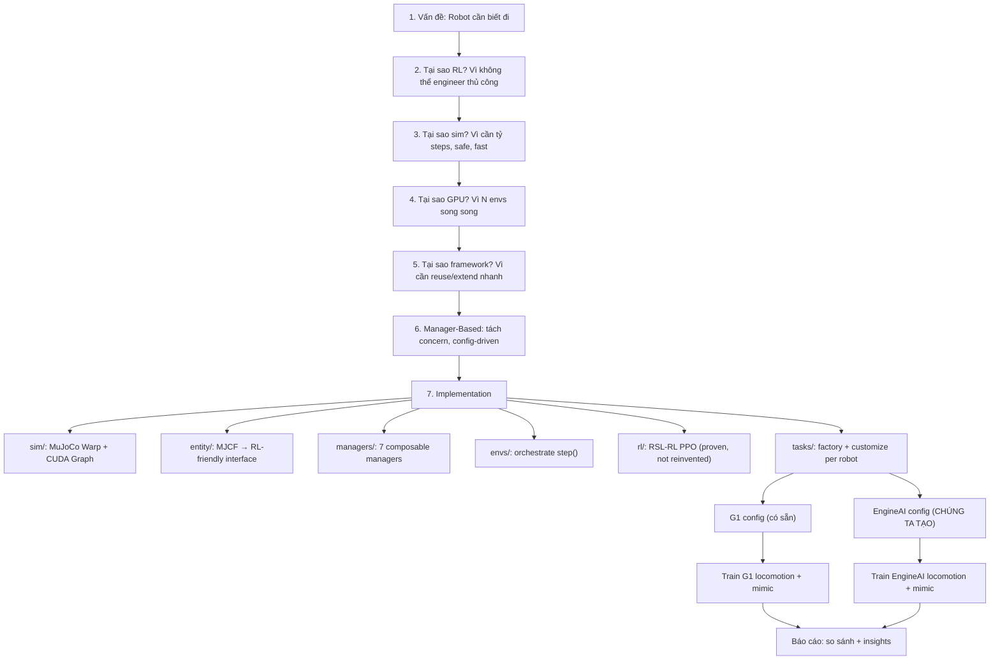

# Phân Tích Codebase mjlab — Triết Lý Thiết Kế & Kiến Trúc

---

## Kết nối với bức tranh toàn cảnh

Ở [big_picture_overview.md](big_picture_overview.md) ta đã xác định:

> Robot humanoid cần **tự học** đi qua RL. Cần simulation GPU để chạy hàng ngàn robot song song. mjlab là framework kết nối **physics engine** (MuJoCo Warp) với **RL algorithm** (PPO/RSL-RL).

Câu hỏi tiếp theo: **làm sao thiết kế framework để nhà nghiên cứu có thể nhanh chóng thử nghiệm?** Đấy chính là câu hỏi mà kiến trúc mjlab trả lời.

---

## Phần I: Vấn đề thiết kế — Tại sao cần framework?

### Nếu không có framework, code trông như thế nào?

Giả sử bạn viết training từ đầu cho 1 robot:

```python
# Monolithic approach - KHÔNG framework
class G1WalkingEnv:
    def step(self, action):
        # 1. Physics substeps
        for _ in range(4):
            torque = self.kp * (action - self.qpos) - self.kd * self.qvel
            mujoco.step(self.model, self.data, torque)
        
        # 2. Compute observations
        obs = np.concatenate([
            self.data.qpos[7:],
            self.data.qvel[6:],
            self.get_gravity_in_body_frame(),
            self.velocity_command,
            self.prev_action
        ])
        
        # 3. Compute reward (hardcoded)
        vel_error = np.linalg.norm(self.data.qvel[:2] - self.velocity_command[:2])
        reward = np.exp(-vel_error**2 / 0.25) * 2.0
        reward -= 0.1 * np.linalg.norm(action - self.prev_action)**2
        reward -= 1.0 * max(0, 0.3 - self.data.qpos[2])  # base height
        # ... 12 reward terms nữa, tất cả hardcoded
        
        # 4. Check termination (hardcoded)
        fell = self.base_tilt() > 70 * np.pi / 180
        
        return obs, reward, fell, {}
```

**Bây giờ, bạn muốn:**
- Thêm robot EngineAI → phải **copy-paste toàn bộ** class, sửa joint names, observation dim, reward thresholds
- Thử thêm 1 reward term mới → sửa giữa hàm `step()`, dễ **break** reward cũ
- Đổi sang motion imitation → viết lại `step()` gần như **từ đầu**
- Thêm domain randomization → chèn code vào nhiều chỗ, **spaghetti**
- Chạy trên GPU → refactor toàn bộ numpy → torch, **effort khổng lồ**

→ **Monolithic approach không scale** khi có nhiều robot, nhiều task, nhiều thí nghiệm.

### Bài toán thiết kế thật sự

Nhà nghiên cứu robot RL cần:

| # | Nhu cầu | Ví dụ cụ thể |
|---|---------|-------------|
| 1 | **Đổi robot nhanh** | G1 → EngineAI → Go1, chỉ đổi config |
| 2 | **Đổi task nhanh** | Locomotion → mimic → manipulation, reuse components |
| 3 | **Thử reward nhanh** | Thêm/bớt/chỉnh weight 1 reward term mà không đụng code khác |
| 4 | **Domain rand** | Randomize friction, mass, delay — ON/OFF theo config |
| 5 | **GPU acceleration** | Hàng ngàn env song song, zero-copy data |
| 6 | **Debug dễ** | Biết reward nào đóng góp bao nhiêu, obs nào đang có giá trị gì |

→ Cần kiến trúc **composable**, **config-driven**, **GPU-native**.

---

## Phần II: Giải pháp — Manager-Based Architecture

### Ý tưởng cốt lõi

**Nhận xét chìa khóa**: mọi RL environment cho robot đều có **6 thành phần giống nhau**, chỉ khác chi tiết:

```
Mọi robot RL env đều cần:
  1. Observations  — robot "nhìn thấy" gì?
  2. Actions       — robot "làm" gì?
  3. Rewards        — hành vi nào "tốt"?
  4. Terminations  — khi nào "kết thúc"?
  5. Events        — randomize cái gì? reset thế nào?
  6. Commands      — mục tiêu cho robot là gì?
```

**Giải pháp**: tách mỗi thành phần thành 1 **Manager** độc lập, cấu hình bằng **dataclass config**:

```python
# THAY VÌ hardcode tất cả trong step():
class G1WalkingEnv:
    def step(self, action):
        obs = [qpos, qvel, gravity, cmd, prev_act]         # hardcoded
        reward = vel_tracking + pose_penalty + ...           # hardcoded
        done = base_tilt > 70                                # hardcoded

# → KHAI BÁO từng thành phần riêng, framework tự tổ hợp:
cfg = ManagerBasedRlEnvCfg(
    observations = {
        "actor": ObservationGroupCfg(terms={
            "joint_pos": ObservationTermCfg(func=mdp.joint_pos_rel, noise=...),
            "base_ang_vel": ObservationTermCfg(func=mdp.base_ang_vel, noise=...),
        })
    },
    rewards = {
        "track_velocity": RewardTermCfg(func=mdp.track_vel, weight=2.0),
        "action_smooth":  RewardTermCfg(func=mdp.action_l2,  weight=-0.1),
    },
    terminations = {
        "fell_over": TerminationTermCfg(func=mdp.bad_orientation, params={"limit": 70°}),
    },
)
```

### Tại sao cách này tốt hơn?

**Thêm robot EngineAI:**
```python
# Không cần viết class mới, chỉ tạo config mới:
cfg = unitree_g1_config()           # Copy base
cfg.scene.entities = {"robot": engineai_pmv2_cfg}  # Đổi robot
cfg.rewards["pose"].params["std_walking"] = {...}  # Tune 1 param
# Done! Framework tự tổ hợp đúng.
```

**Thêm 1 reward term:**
```python
# Chỉ thêm 1 dòng trong dict:
cfg.rewards["new_term"] = RewardTermCfg(func=mdp.my_new_func, weight=0.5)
# Không đụng code cũ. Bật tắt bằng weight=0.0.
```

**Đổi task (locomotion → mimic):**
```python
# Giữ nguyên robot config, chỉ đổi rewards + observations:
cfg.rewards = mimic_rewards        # Motion tracking rewards thay velocity tracking
cfg.observations = mimic_obs       # Thêm reference motion vào observation
# Reuse toàn bộ: scene, sim, actions, terminations, events
```

### Có phương án thiết kế khác không?

| Phương án | Ưu điểm | Nhược điểm | Ai dùng? |
|-----------|---------|-----------|---------|
| **Monolithic** (1 class chứa hết) | Đơn giản, dễ debug | Không reuse, copy-paste | legged_gym cũ |
| **Inheritance** (subclass cho mỗi robot) | Quen thuộc OOP | Diamond problem, rigid hierarchy | Một số gym envs |
| **Manager-Based** (config-driven) | Composable, reusable, extensible | Learning curve, indirection | **Isaac Lab, mjlab** |
| **ECS** (Entity-Component-System) | Cực kỳ flexible | Quá phức tạp cho RL | Game engines |

**mjlab chọn Manager-Based** vì:
- Cộng đồng RL đã validate qua Isaac Lab (NVIDIA) — proven pattern
- Cân bằng giữa flexibility và simplicity
- Config-driven → nhà nghiên cứu chỉ cần edit Python dataclass, không cần hiểu internals
- Phù hợp cả robotics veteran lẫn ML researcher

---

## Phần III: Các tầng kiến trúc — từ dưới lên

Hình dung mjlab như tòa nhà 7 tầng, mỗi tầng xây trên tầng dưới:

```
 TẦNG 7: tasks/     "Công thức hoàn chỉnh"
         ┌──────────────────────────────────────────┐
         │  Velocity task: robot + reward + obs      │
         │  Tracking task: robot + motion + reward   │
         └──────────────────────────────────────────┘
                          ↓ dùng
 TẦNG 6: rl/        "Đầu bếp" — PPO training loop
         ┌──────────────────────────────────────────┐
         │  RSL-RL PPO + MjlabOnPolicyRunner         │
         │  Rollout → GAE → PPO update → log         │
         └──────────────────────────────────────────┘
                          ↓ dùng
 TẦNG 5: envs/      "Nhà bếp" — orchestrate 1 env step
         ┌──────────────────────────────────────────┐
         │  ManagerBasedRlEnv.step():                │
         │    action → decimation loop → reward      │
         │    → termination → reset → forward → obs  │
         └──────────────────────────────────────────┘
                          ↓ dùng
 TẦNG 4: managers/  "Nhân viên" — mỗi người 1 việc
         ┌──────────────────────────────────────────┐
         │  ObsManager | ActionManager | RewardMgr   │
         │  TermMgr | EventMgr | CmdMgr | CurrMgr   │
         └──────────────────────────────────────────┘
                          ↓ dùng
 TẦNG 3: scene/     "Sân khấu" — bố trí thế giới
         ┌──────────────────────────────────────────┐
         │  Terrain + Entity(robot) + Sensors        │
         │  → Compile into MjModel + MjData          │
         └──────────────────────────────────────────┘
                          ↓ dùng
 TẦNG 2: entity/ + actuator/ + sensor/  "Diễn viên + đạo cụ"
         ┌──────────────────────────────────────────┐
         │  Entity: parse MJCF → joints, limits      │
         │  Actuator: PD controller → torque          │
         │  Sensor: IMU, contact, raycast             │
         └──────────────────────────────────────────┘
                          ↓ dùng
 TẦNG 1: sim/       "Nền móng" — GPU physics
         ┌──────────────────────────────────────────┐
         │  MuJoCo Warp: N robots song song GPU      │
         │  CUDA Graphs: record-replay kernel seq    │
         │  WarpBridge: zero-copy Warp ↔ PyTorch     │
         └──────────────────────────────────────────┘
```

### Tầng 1: `sim/` — Tại sao cần abstraction layer cho physics?

**Vấn đề**: MuJoCo Warp dùng API riêng (Warp arrays). PyTorch dùng tensors. PPO cần PyTorch tensors. Làm sao kết nối?

**Giải pháp — WarpBridge + TorchArray**:
```python
# Thay vì copy data:  tensor = torch.from_numpy(warp_array)     ← CHẬM, tốn RAM
# mjlab dùng zero-copy: tensor = wp.to_torch(warp_array)        ← NHANH, shared memory

class WarpBridge:
    """Truy cập sim.data.qpos → tự động trả về PyTorch tensor."""
    
    def __getattr__(self, name):
        val = getattr(underlying_warp_struct, name)
        if isinstance(val, wp.array):
            return TorchArray(val)  # Wrap as PyTorch, SAME GPU memory
    
    def __setattr__(self, name, value):
        raise Error("Read-only! Use in-place: data.qpos[:] = new_values")
        # Tại sao? Vì CUDA Graph ghi nhớ pointer addresses.
        # Assignment tạo pointer mới → graph đọc pointer cũ → sai data.
```

**Tại sao CUDA Graphs?**
```
Không có graph:                  Có graph:
  CPU: launch kernel 1           CPU: launch graph (1 call)
  CPU: launch kernel 2           GPU: replay tất cả kernels
  CPU: launch kernel 3                (zero CPU overhead)
  CPU: launch kernel 4
  ... (CPU bottleneck!)
```
→ MuJoCo Warp `step()` gồm hàng chục GPU kernels. Không có graph, CPU dispatch từng kernel → bottleneck. Có graph, 1 lần launch → replay tất cả.

**Trade-off**: Graph ghi nhớ GPU memory addresses → nếu allocate array mới (do domain rand expand fields) → phải `create_graph()` lại. mjlab xử lý tự động.

### Tầng 2: `entity/` — Tại sao không dùng MJCF trực tiếp?

**Vấn đề**: MJCF XML định nghĩa 100+ bodies, joints, geoms. Nhưng RL chỉ cần:
- 24 controlled joints (không cần cosmetic bodies)
- Joint position limits (để clamp action)
- Default pose (để tính action offset)
- PD gains cho actuators

**Giải pháp — Entity làm bridge**:
```
MJCF XML (raw robot description)
    ↓ Entity.__init__()
    ↓ Parse joints, identify free/actuated
    ↓ Add actuators (PD, DC, delay...)
    ↓ Create keyframe (default pose)
    ↓
MjSpec → compile() → MjModel (GPU-ready)
    ↓ Entity.initialize()
    ↓ Compute global indices: joint_ids, body_ids
    ↓ Allocate EntityData: targets, limits, biases
    ↓
EntityData (clean RL-friendly interface)
```

**Tại sao không hardcode joint names?**

```python
# ❌ Hardcode:
qpos_hip = data.qpos[7:10]     # Chỉ đúng cho 1 robot

# ✅ Entity approach:
hip_ids = entity.find_joints(".*hip.*")  # Regex match
qpos_hip = data.qpos[:, entity.indexing.joint_q_adr[hip_ids]]  # Works for any robot
```

### Tầng 4: `managers/` — Tại sao tách thành 7 managers?

**Nhận xét**: mỗi RL environment step luôn làm **6 việc giống nhau**:

```
step(action):
  1. Process action           ← ActionManager
  2. Advance physics          ← Simulation
  3. Compute observations     ← ObservationManager
  4. Compute reward           ← RewardManager
  5. Check termination        ← TerminationManager
  6. Handle events (reset, DR) ← EventManager
  + Commands, Curriculum       ← CommandManager, CurriculumManager
```

**Tại sao không gộp lại?** Vì mỗi cái có lifecycle riêng:
- Reward terms thay đổi mỗi thí nghiệm (core research variable)
- Observations thay đổi khi đổi robot (sensor layout khác)
- Events thay đổi khi đổi environment (sim-to-real tuning)
- Nhưng `step()` orchestration gần như **không bao giờ đổi**

→ Tách = thay đổi chi tiết mà không đụng flow chính.

### Tầng 5: `envs/` — env.step() chi tiết

```python
def step(self, action):
    ## PHASE 1: DECIMATION (4 physics substeps per env step)
    # Tại sao decimation? Control ở 50Hz, physics ở 200Hz.
    # Physics cần dt nhỏ để ổn định (0.005s).
    # Policy chỉ cần quyết định mỗi 0.02s (đủ nhanh cho locomotion).
    self.action_manager.process_action(action)    # Scale + offset
    for _ in range(4):  # 4 × 0.005s = 0.02s env step
        self.action_manager.apply_action()          # Target → actuator
        self.scene.write_data_to_sim()              # PD → torque → ctrl
        self.sim.step()                             # MuJoCo Warp GPU physics
        self.scene.update(dt=0.005)                 # Update actuator state

    ## PHASE 2: RL SIGNALS
    self.termination_manager.compute()   # Ngã? Hết thời gian?
    self.reward_manager.compute(dt=0.02) # Tổng 14 terms × weights × dt

    ## PHASE 3: RESET terminated envs
    reset_ids = self.reset_buf.nonzero()
    if len(reset_ids) > 0:
        self._reset_idx(reset_ids)       # Reset physics state + randomize
        self.scene.write_data_to_sim()   # Write reset state to GPU

    ## PHASE 4: FORWARD (1 call cho TẤT CẢ envs)
    self.sim.forward()
    # Tại sao 1 forward cho cả reset và non-reset?
    # → Tiết kiệm 1 forward() call. Stale-by-1-substep là acceptable
    #   vì consistent across all envs → MDP vẫn well-defined.

    ## PHASE 5: OBSERVATIONS
    self.command_manager.compute()        # Sample velocity commands
    self.sim.sense()                       # Camera/raycast (nếu có)
    obs = self.observation_manager.compute()  # Concat all obs terms
    
    return (obs, reward, terminated, truncated, extras)
```

### Tầng 6: `rl/` — Tại sao dùng RSL-RL thay vì tự viết PPO?

**Phương án thay thế:**

| Option | Ưu | Nhược |
|--------|-----|------|
| Tự viết PPO | Full control | Reinvent wheel, bugs, thiếu features |
| Stable-Baselines3 | Popular, tested | Không optimized cho GPU vecenv |
| CleanRL | Simple, educational | Thiếu prod features |
| **RSL-RL** | **Designed cho legged robots** | Ít tài liệu |

**mjlab chọn RSL-RL** vì:
1. ETH Zurich viết RSL-RL **chuyên cho legged robot locomotion**
2. Đã được validate bởi hàng chục paper (ANYmal, legged_gym, Go1...)
3. Có sẵn: adaptive LR, observation normalization, checkpoint migration
4. PPO implementation tối ưu cho on-policy + GPU vecenv

**mjlab chỉ cần thin wrapper**:
```python
class MjlabOnPolicyRunner(OnPolicyRunner):  # Extend RSL-RL
    def save(self, path):    # Thêm: save curriculum state
    def load(self, path):    # Thêm: migrate legacy checkpoints
    def export_onnx(self):   # Thêm: export for deployment
    # PPO algorithm = hoàn toàn từ RSL-RL, không sửa gì
```

### Tầng 7: `tasks/` — Factory Pattern cho task configs

**Vấn đề**: G1 và EngineAI locomotion dùng **90% config giống nhau** (rewards, terminations, curriculum). Chỉ khác robot model + một số thresholds.

**Giải pháp — Factory + Customize**:
```python
# Base factory (robot-agnostic):
def make_velocity_env_cfg():
    return ManagerBasedRlEnvCfg(
        rewards={14 shared reward terms},
        terminations={fell_over, time_out},
        observations={7 shared obs terms},
        ...
    )

# G1-specific:
def g1_velocity_cfg():
    cfg = make_velocity_env_cfg()              # Start from shared base
    cfg.scene.entities = {"robot": g1_cfg}     # Plug in G1
    cfg.rewards["pose"].params["std"] = {...}  # G1-specific tuning
    return cfg

# EngineAI-specific (CẦN TẠO):
def pmv2_velocity_cfg():
    cfg = make_velocity_env_cfg()              # SAME shared base!
    cfg.scene.entities = {"robot": pmv2_cfg}   # Plug in EngineAI
    cfg.rewards["pose"].params["std"] = {...}  # EngineAI-specific
    return cfg
```

**Tại sao factory thay vì inheritance?**
- Inheritance: `class G1Env(BaseEnv)` → nguy hiểm nếu base thay đổi
- Factory: `cfg = make_base(); cfg.xxx = yyy` → explicit, traceable, no hidden overrides

---

## Phần IV: Reward Design — Bộ não của locomotion

### Triết lý: Positive + Penalty

mjlab velocity task dùng **14 reward terms** chia 2 nhóm:

**Nhóm POSITIVE (thúc đẩy hành vi mong muốn):**
```
track_linear_velocity  (+2.0)  → Đi đúng tốc độ lệnh
track_angular_velocity (+2.0)  → Xoay đúng hướng lệnh
upright                (+1.0)  → Giữ thân thẳng đứng
pose                   (+1.0)  → Giữ tư thế gần default
```

**Nhóm PENALTY (phạt hành vi không mong muốn):**
```
action_rate_l2         (-0.05) → Phạt action giật
dof_pos_limits         (-1.0)  → Phạt chạm joint limit
foot_clearance         (-2.0)  → Phạt chân không nâng đủ cao
foot_slip              (-0.1)  → Phạt chân trượt khi chạm đất
soft_landing           (-1e-5) → Phạt đập chân xuống mạnh
self_collisions        (-1.0)  → Phạt body tự va chạm
body_ang_vel           (-0.05) → Phạt torso lắc
angular_momentum       (-0.02) → Phạt momentum toàn thân
foot_swing_height      (-0.25) → Phạt chân không đúng chiều cao
air_time               (0.0)   → Disabled cho G1
```

**Tại sao negative weight = penalty?**

Reward = Σ(positive terms) + Σ(negative terms). Robot tối đa hóa tổng:
- Muốn reward cao → tối đa positive
- Muốn reward cao → tối thiểu |negative|
- → Robot tìm cách đi đúng lệnh MÀ KHÔNG giật/trượt/ngã

**Nếu chỉ có positive**: robot "cheat" — tìm pose lạ có reward cao mà không đi
**Nếu quá nhiều penalty**: robot đứng yên (an toàn nhất, penalty = 0, nhưng reward = 0)
→ **Cân bằng** positive/penalty là kỹ thuật quan trọng nhất trong reward design.

### speed-dependent pose reward — thiết kế tinh tế

```python
"pose": RewardTermCfg(
    func=mdp.variable_posture,
    params={
        "std_standing": {".*": 0.05},          # Rất chặt khi đứng
        "std_walking":  {".*knee.*": 0.35, ...}, # Lỏng hơn khi đi
        "std_running":  {".*knee.*": 0.60, ...}, # Rất lỏng khi chạy
    }
)
```

**Ý nghĩa**: khi đứng yên, robot phải giữ pose gần default (std nhỏ = tight gaussian). Khi đi, đầu gối cần cong nhiều → nới std. Khi chạy, cần range lớn hơn nữa.

→ Reward **adapts theo tốc độ** — tinh tế hơn nhiều so với 1 reward cố định.

---

## Phần V: Domain Randomization — Tại sao sim ≠ real?

### Vấn đề sim-to-real gap

| Yếu tố | Sim | Real |
|---------|-----|------|
| Ma sát | Chính xác (Coulomb model) | Biến đổi theo bề mặt |
| Khối lượng | Từ CAD model | Có tolerance ±5% |
| Motor delay | 0ms | 5-20ms communication delay |
| Encoder | Perfect | Có bias/drift |
| External force | None | Wind, người đẩy |

### Giải pháp — Domain Randomization qua EventManager

```python
events = {
    # Startup (1 lần khi init — khác nhau giữa các env):
    "foot_friction": randomize friction [0.3, 1.2],
    "encoder_bias":  random joint bias ±0.015 rad,
    "base_com":      random COM offset ±2.5cm,
    
    # Reset (mỗi episode mới):
    "reset_base":   random position ±0.5m, yaw ±π,
    "reset_joints": reset to default pose,
    
    # Interval (mỗi 1-3 giây):
    "push_robot":   random push ±0.5m/s,
}
```

**Tại sao mỗi event có mode khác nhau?**
- `startup`: tạo **diversity giữa envs** — env 0 friction=0.3, env 1 friction=1.2 → policy phải generalizable
- `reset`: random initial conditions → policy handle mọi tình huống
- `interval`: simulate external disturbances → policy robust

→ Policy trained với domain rand **transfer tốt sang robot thật** vì đã "thấy" many variations.

---

## Phần VI: Tổng kết — Mọi thứ kết nối ra sao



**Tại sao bài test yêu cầu tạo EngineAI config?**
- Nếu chỉ train G1 → chứng minh biết chạy lệnh `uv run train`
- Tạo EngineAI config → chứng minh **hiểu kiến trúc đủ sâu để extend**
- Đây chính là lý do codebase được thiết kế composable: để **thêm robot mới = thêm config, không sửa framework**
- Bài test đang kiểm tra bạn có exploit được design này không

---

## Appendix: Quick Reference

### env.step() — 5 phases

| Phase | Code | Manager | GPU? |
|-------|------|---------|------|
| 1. Decimation | `sim.step()` ×4 | ActionManager | ✅ CUDA Graph |
| 2. RL signals | `term.compute()`, `rew.compute()` | Term+Reward | ✅ Batched |
| 3. Reset | `sim.reset(env_ids)` | EventManager | ✅ CUDA Graph |
| 4. Forward | `sim.forward()` | — | ✅ CUDA Graph |
| 5. Observe | `obs.compute()` | ObsManager | ✅ Batched |

### PPO hyperparameters

| Param | Value | Why |
|-------|-------|-----|
| Actor/Critic | MLP [512,256,128] ELU | Sufficient for locomotion, not too large |
| Learning rate | 1e-3 adaptive | Auto-adjust: KL>0.02→lr/2, KL<0.005→lr×2 |
| Clip ε | 0.2 | Industry standard for continuous control |
| GAE (γ,λ) | (0.99, 0.95) | ~2s horizon at 50Hz, bias-variance balance |
| Rollout | 24 steps/env | ~0.5s → enough to see consequence of falling |
| Epochs | 5, mini-batches=4 | On-policy: don't reuse data too much |

### Manager initialization order (critical!)

```
1. EventManager      ← must be first (expand model fields for DR)
2. CommandManager    ← before ObsManager (obs may reference commands)
3. ActionManager     ← define action space
4. ObservationManager ← define obs space (needs actions + commands)
5. TerminationManager
6. RewardManager
7. CurriculumManager
8. MetricsManager
```
